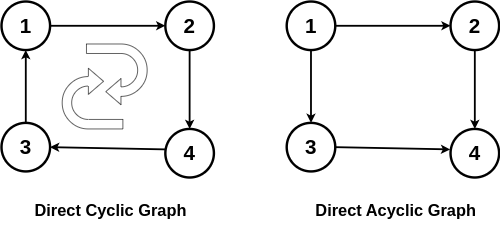
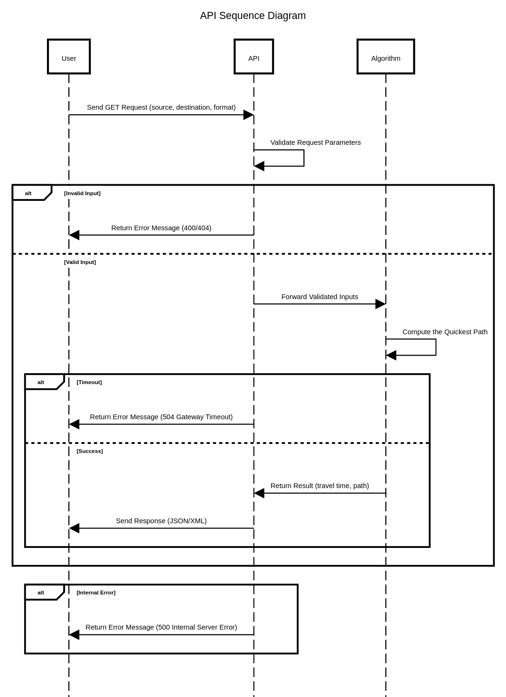

# Technical Specifications

---

<details>
<summary>Table of Contents</summary>

- [Technical Specifications](#technical-specifications)
	- [Introduction](#introduction)
		- [Project Overview](#project-overview)
	- [Technical Requirements](#technical-requirements)
		- [REST API Requirements](#rest-api-requirements)
		- [Data Source](#data-source)
		- [Performance Requirements](#performance-requirements)
		- [Data Integrity Checks](#data-integrity-checks)
		- [Expected Deliverables](#expected-deliverables)
	- [Development Environment](#development-environment)
		- [File Structure](#file-structure)
		- [Dependencies](#dependencies)
			- [STL](#stl)
			- [HTTP Library](#http-library)
		- [REST API](#rest-api)
			- [**API Sequence Diagram Explanation**](#api-sequence-diagram-explanation)
			- [**Why These Improvements Matter?**](#why-these-improvements-matter)
		- [LocalHost](#localhost)
			- [Localhost Configuration](#localhost-configuration)
			- [Example Request and Response](#example-request-and-response)
				- [Expected Response](#expected-response)
				- [Error Response](#error-response)

</details>

---

## Introduction

### Project Overview

This project aims to build a high-performance REST API designed to compute the quickest path between two landmarks in the United States. Developed in C++, the system will process a dataset containing up to 24 million nodes and deliver results within 1 second on an average laptop. The API supports user-selectable response formats (JSON or XML) and is designed to handle invalid inputs gracefully.

This project is really valuable because it will enable users to quickly find the shortest path between two landmarks in the United States. This is particularly useful for tourists, who can use the API to plan their trips more efficiently. The API can also be used by logistics companies to optimize their delivery routes, saving time and money.

## Technical Requirements

The software must be developed in C++, allowing for high performance and efficient memory management.

### REST API Requirements

The system must expose a REST API that accepts HTTP GET requests with the following parameters:

- `source`: The starting landmark
- `destination`: The ending landmark
- `format`: The desired response format (JSON or XML)
  - This is an optional parameter, with JSON being the default format if not specified

The API must return the quickest path between the two landmarks in the specified format. If the input is invalid (e.g., landmarks not found), the API should return an appropriate error message that will be explained later in this document.

However, if both the source and destination are valid landmarks, the API should return the quickest path between them with the following information:

- `time`: The time taken to travel between the two landmarks
- `path`: The sequence of landmarks to visit to reach the destination

Here an example of a GET request to the API:

> [!WARNING]  
> Data is not real and is used for illustrative purposes only.

```http
curl "http://localhost:18080/quickestpath?source=1&destination=12"
```

And the expected response in JSON format:

```json
{
  "time": 120,
  "path": [1, 5, 12]
}
```

The system must be able to handle invalid inputs gracefully, returning appropriate error messages in the specified format.

The API must be well-documented, with clear examples of how to use it and what to expect in the responses. The documentation must be available in Markdown format and hosted on GitHub for easy access.

The system must be thoroughly tested to ensure that it meets the performance requirements and delivers accurate results. Unit tests must be written to cover all possible scenarios and edge cases.

### Data Source

The given dataset for this software project is a .csv file named `USA-Roads.csv`, containing exactly 23,947,347 lines. Each line represents a road segment in the United States, with the following columns:

```csv
Landmark_A_ID, Landmark_B_ID, Time
```

Each line is bidirectional, meaning that the time to travel from Landmark A to Landmark B is the same as the time to travel from Landmark B to Landmark A.

### Performance Requirements

The API must be able to process the entire dataset within 1 second on an average laptop. To achieve this, the system must be optimized for performance, with efficient algorithms and data structures.

As we need to prioritize speed over precision, we are willing to accept a small margin of error in the results, exactly 10%. This means that the time returned by the API must be in the top 10% of the actual shortest path between the two given landmarks.

### Data Integrity Checks

Before processing the dataset, the system must perform data integrity checks to ensure that the data is valid and consistent, here are the checks that must be performed:

- Verify tif the graph might be a [DAG](https://en.wikipedia.org/wiki/Directed_acyclic_graph) (Directed Acyclic Graph) free of cycles. In other words, you cannot traverse a sequence of directed edges and return to the same node, following the edge directions.
  Here an picture showing the difference between a DCG and a DAG:

  

  As you might see, the DCG has a cycle, 1 -> 2 -> 3 -> 4-> 1, while the DAG does not have any cycle as the nodes 2 and 3 both point to the node 4, but the node 4 does not point to any other node.

- Verify than all the nodes are connected, meaning that you can reach any node from any other node in the graph. We can't simply check if a node is alone or linked to another node, as if we take the extreme case of our .csv, if we have 3 nodes linked together, representing the roads of an island, we can't reach the island from the mainland, and the mainland from the island. Meaning that the graph is not connected.

> [!NOTE]
> We're allowed to perform these checks in a separate step before processing the dataset, as we're not required to check these conditions at each request.
> We're also allowed to perform these checks in another language than C++, as long as the checks are performed before processing the dataset.

### Expected Deliverables

The project must be delivered as a GitHub repository containing the following components:

1. C++ source code: Including detailed comments and clear documentation of the algorithms used.
2. Time complexity analysis: A document explaining the time complexity of the algorithms used in the system. (The Big O notation is required)
3. Data verification code: A separate script in any language that performs the data integrity checks described above.
4. REST API: A well-documented REST API that meets the specified requirements.
5. Unit tests: A suite of unit tests that cover all possible scenarios and edge cases.

## Development Environment

The chosen language for this project is C++, as it provides high performance and efficient memory management. The system must be developed using modern C++ standards to take advantage of the latest features and optimizations.

Regarding the IDE, we strongly recommend using Visual Studio Code with the C++ extension, as it provides excellent support for C++ development and integrates well with GitHub.

As we need to use only the standard library, no external libraries are allowed in this project. To see the full list of allowed libraries, please refer to the [C++ Standard Library](https://cplusplus.com/reference/) documentation.

### File Structure

The file structure of the project should be as follows:

```plaintext
2024-2025-project-3-quickest-path-team-4/
├── .github/
├── Documents/
├── src/
│   ├── data/
│   │   ├── USA-Roads.csv
│   ├── Graph.cpp
│   ├── Graph.hpp
│   ├── PathFinder.cpp
│   ├── PathFinder.hpp
|   ├── QuickestPath.cpp
|   ├── RestApi.cpp
│   ├── RestApi.hpp
|   ├── httplib.hpp
├── .gitignore
├── LICENSE
├── README.md
```

The `src` directory contains the source code of the project.

### Dependencies

#### STL

The project must use only the C++ Standard Library, no external libraries are allowed. To see the full list of allowed libraries, please refer to the [C++ Standard Library](https://cplusplus.com/reference/) documentation.

However, for this project, performance and scalability are the main concerns, so we need to use the most efficient algorithms and data structures available in the C++ Standard Library.

Here's a list of the libraries that we recommend using:

- `algorithm`: A library that provides a collection of functions for performing operations on ranges of elements.
- `chrono`: A library that provides time-related functions.
- `fstream`: A library that provides file input and output operations.
- `iostream`: A library that provides input and output operations.
- `limits`: A library that provides constants for the limits of fundamental data types.
- `queue`: A container that provides a FIFO (First In First Out) data structure.
- `string`: A library that provides string manipulation functions.
- `sstream`: A library that provides string stream classes.
- `unordered_map`: A key-value container that stores elements in an unordered way.
- `utility`: A library that provides various utility functions.
- `vector`: A dynamic array that can grow and shrink in size.

#### HTTP Library

As we need to expose a REST API, we need to use an HTTP library to handle HTTP requests and responses. We recommend using the `httplib` library, a C++ header-only library that provides a simple and easy-to-use interface for creating HTTP servers and clients.

You can find the `httplib` library [here](https://github.com/yhirose/cpp-httplib)

This library is lightweight, efficient, and easy to integrate into the project. It allows us to create a REST API quickly and handle HTTP requests and responses with ease.

### REST API

The REST API, or Representational State Transfer Application Programming Interface, is a set of rules and conventions for building and interacting with web services. It is based on the principles of REST, a style of software architecture that defines a set of constraints for creating scalable and reliable web services.

For this project, the REST API only needs to support the `GET` method, as we are only retrieving data from the server. Here's the sequence diagram of the API:



#### **API Sequence Diagram Explanation**

This sequence diagram illustrates how the **REST API processes requests** to compute the quickest path between two landmarks. Below are the key steps and improvements:

1. **User Request:**

   - The user sends a **GET request** to the API with parameters (`source`, `destination`, `format`).

2. **Validation Stage:**

   - The API **validates** the input parameters.
   - If the input is **invalid** (e.g., missing parameters, non-existent landmarks), the API **immediately returns** an appropriate **error response (400/404)** without calling the Algorithm.

3. **Processing the Quickest Path:**

   - If the input is valid, the API forwards the request to the **Algorithm**, which computes the quickest path.

4. **Handling Timeouts:**

   - If the Algorithm takes too long to compute, the API **returns a 504 Gateway Timeout** to the user.
   - This ensures the system remains responsive.

5. **Successful Response:**

   - If the computation succeeds, the Algorithm returns the **travel time** and **path sequence** to the API.
   - The API sends the response in **JSON or XML format** based on the user’s request.

6. **Handling Internal Errors:**
   - If an unexpected issue occurs (e.g., dataset corruption, computation failure), the API **returns a 500 Internal Server Error** instead of crashing.
   - This prevents exposing unnecessary system details to the user.

#### **Why These Improvements Matter?**

✅ **Faster response times** by rejecting invalid requests early.  
✅ **Better reliability** by handling timeouts and internal errors.  
✅ **Clearer API behavior** for users and developers.

### LocalHost

The API must be hosted on `localhost` and listen on port `18080`. This is the default configuration for the API, and users can access it by sending requests to `http://localhost:18080/quickestpath`.

Using the localhost environment allows developers to test the API locally before deploying it to a production server. It also simplifies the development process by providing a controlled environment for debugging and testing.

#### Localhost Configuration

- **Host:** `localhost`
- **Port:** `18080`
- **Endpoint:** `/quickestpath`
- **Method:** `GET`
- **Parameters:**
  - `source`: The starting landmark
  - `destination`: The ending landmark
  - `format`: The desired response format (JSON or XML) (optional)

#### Example Request and Response

Here's an example of a GET request to the API:

```http
curl "http://localhost:18080/quickestpath?source=1&destination=12"
```

##### Expected Response

If the input is valid, the API should return the quickest path between the two landmarks in JSON format:

```json
{
  "time": 120,
  "path": [1, 5, 12]
}
```

or in XML format:

```xml
<quickestpath>
  <time>120</time>
  <path>
    <landmark>1</landmark>
    <landmark>5</landmark>
    <landmark>12</landmark>
  </path>
</quickestpath>
```

##### Error Response

If the input is invalid (e.g., landmarks not found), the API should return an appropriate error message in JSON format:

```json
{
  "code": 404,
  "error": "Landmarks not found"
}
```
