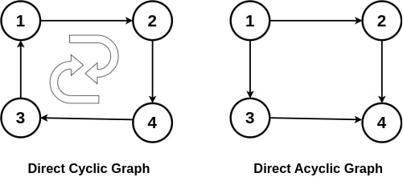

# Technical Specifications

---

<details>
<summary>Table of Contents</summary>

- [Technical Specifications](#technical-specifications)
  - [Introduction](#introduction)
    - [Project Overview](#project-overview)
  - [Technical Requirements](#technical-requirements)
    - [REST API Requirements](#rest-api-requirements)
    - [Data Source](#data-source)
    - [Performance Requirements](#performance-requirements)
    - [Data Integrity Checks](#data-integrity-checks)
    - [Expected Deliverables](#expected-deliverables)
  - [Development Environment](#development-environment)
    - [File Structure](#file-structure)
    - [Dependencies](#dependencies)
      - [STL](#stl)
      - [HTTP Library](#http-library)
    - [REST API](#rest-api)
      - [**API Sequence Diagram Explanation**](#api-sequence-diagram-explanation)
      - [**Why These Improvements Matter?**](#why-these-improvements-matter)
    - [LocalHost](#localhost)
      - [Localhost Configuration](#localhost-configuration)
      - [Example Request and Response](#example-request-and-response)
        - [Expected Response](#expected-response)
        - [Error Response](#error-response)
          - [Error 400: Bad Request](#error-400-bad-request)
          - [Error 404: Not Found](#error-404-not-found)
          - [Error 500: Internal Server Error](#error-500-internal-server-error)
          - [Error 503: Service Unavailable](#error-503-service-unavailable)
          - [Error 504: Gateway Timeout](#error-504-gateway-timeout)
    - [Algorithm](#algorithm)
      - [Algorithm Pseudocode](#algorithm-pseudocode)
        - [Terms Definition](#terms-definition)
        - [Explanation](#explanation)
      - [Complexity](#complexity)
    - [Data Integrity Verification](#data-integrity-verification)
      - [Functional Requirements](#functional-requirements)
      - [Solution](#solution)
        - [Breadth-First Search (BFS)](#breadth-first-search-bfs)
        - [Depth-First Search (DFS)](#depth-first-search-dfs)
        - [Performance](#performance)
          - [Optimization Techniques](#optimization-techniques)
    - [Testing](#testing)
      - [Unit Tests](#unit-tests)
  - [Conclusion](#conclusion)

</details>

---

## Introduction

### Project Overview

This project aims to build a high-performance REST API designed to compute the quickest path between two landmarks in the United States. Developed in C++, the system will process a dataset containing up to 24 million nodes and deliver results within 1 second on an average laptop. The API supports user-selectable response formats (JSON or XML) and is designed to handle invalid inputs gracefully.

This project is valuable because it will enable users to quickly find the shortest path between two landmarks in the United States. This is particularly useful for tourists, who can use the API to plan their trips more efficiently. The API can also be used by logistics companies to optimize their delivery routes, saving time and money.

## Technical Requirements

The software must be developed in C++, allowing for high performance and efficient memory management.

### REST API Requirements

The system must expose a REST API that accepts HTTP GET requests with the following parameters:

- `source`: The starting landmark
- `destination`: The ending landmark
- `format`: The desired response format (JSON or XML)
  - This is an optional parameter, with JSON being the default format if not specified

The API must return the quickest path between the two landmarks in the specified format. If the input is invalid (e.g., landmarks not found), the API should return an appropriate error message, which will be explained later in this document.

If both the source and destination are valid landmarks, the API should return the quickest path between them, including the following details:

- `time`: The time taken to travel between the two landmarks
- `path`: The sequence of landmarks to visit to reach the destination

Here is an example of a GET request to the API:

> [!WARNING]  
> Data is not real and is used for illustrative purposes only.

```http
curl "http://localhost:18080/quickestpath?source=1&destination=12"
```

And the expected response in JSON format:

```json
{
  "time": 120,
  "path": [1, 5, 12]
}
```

The system must handle invalid inputs gracefully, returning appropriate error messages in the specified format.

The API must have well-structured documentation with clear examples of its usage and expected responses. The documentation should be in Markdown format and hosted on GitHub for easy access.

The system must undergo thorough testing to ensure it meets performance requirements and delivers accurate results. Unit tests must cover all possible scenarios and edge cases.

### Data Source

The given dataset for this software project is a .csv file named `USA-Roads.csv`, containing exactly 23,947,347 lines. Each line represents a road segment in the United States, with the following columns:

```csv
Landmark_A_ID, Landmark_B_ID, Time
```

Each line is bidirectional, meaning that the time to travel from Landmark A to Landmark B is the same as the time to travel from Landmark B to Landmark A.

### Performance Requirements

The API must be able to process the entire dataset within 1 second on an average laptop. To achieve this, the system must be optimized for performance, with efficient algorithms and data structures.

As we must prioritize speed over precision, we are willing to accept a small margin of error in the results, exactly 10%. This means that the time returned by the API must be in the top 10% of the actual shortest path between the two given landmarks.

### Data Integrity Checks

Before processing the dataset, the system must perform data integrity checks to ensure that the data is valid and consistent, here are the checks that must be performed:

- Verify if the graph might be a [DAG](https://en.wikipedia.org/wiki/Directed_acyclic_graph) (Directed Acyclic Graph) free of cycles. In other words, you cannot traverse a sequence of directed edges and return to the same node, following the edge directions.
  Here is a picture showing the difference between a DCG and a DAG:



As you might see, the DCG has a cycle, 1 -> 2 -> 3 -> 4-> 1, while the DAG does not have any cycle as the nodes 2 and 3 both point to the node 4, but the node 4 does not point to any other node.

- Verify that all the nodes are connected, meaning that you can reach any node from any other node in the graph. We can't simply check if a node is alone or linked to another node, as if we take the extreme case of our `.csv` file, where we have three nodes linked together, representing the roads of an island, we can't reach the island from the mainland, and the mainland from the island. This means that the graph is not connected.

> [!NOTE]
> We're allowed to perform these checks in a separate step before processing the dataset, as we're not required to check these conditions at each request.
> We're allowed to perform these checks in a language other than C++, as long as the checks are performed before processing the dataset.

### Expected Deliverables

The project must be delivered as a GitHub repository containing the following components:

1. C++ source code: Including detailed comments and clear documentation of the algorithms used.
2. Time complexity analysis: A document explaining the time complexity of the algorithms used in the system. (The Big O notation is required)
3. Data verification code: A separate script in any language that performs the data integrity checks described above.
4. REST API: A well-documented REST API that meets the specified requirements.
5. Unit tests: A suite of unit tests that cover all possible scenarios and edge cases.

## Development Environment

The chosen language for this project is C++, as it provides high-performance and efficient memory management. The system must be developed using modern C++ standards to take advantage of the latest features and optimizations.

Regarding the IDE, we strongly recommend using Visual Studio Code with the C++ extension, as it provides excellent support for C++ development and integrates well with GitHub.

Since we are restricted to using only the standard library, external libraries are not allowed in this project. To see the full list of allowed libraries, please refer to the [C++ Standard Library](https://cplusplus.com/reference/) documentation.

### File Structure

The file structure of the project should be as follows:

```plaintext
2024-2025-project-3-quickest-path-team-4/
├── .github/
├── Documents/
├── src/
│   ├── data/
│   │   ├── USA-Roads.csv
│   ├── Graph.cpp
│   ├── Graph.hpp
│   ├── PathFinder.cpp
│   ├── PathFinder.hpp
|   ├── QuickestPath.cpp
|   ├── RestApi.cpp
│   ├── RestApi.hpp
|   ├── httplib.hpp
├── .gitignore
├── LICENSE
├── README.md
```

The `src` directory contains the source code of the project.

### Dependencies

#### STL

The project must use only the C++ Standard Library, no external libraries are allowed. To see the full list of allowed libraries, please refer to the [C++ Standard Library](https://cplusplus.com/reference/) documentation.

However, for this project, performance and scalability are the main concerns, so we need to use the most efficient algorithms and data structures available in the C++ Standard Library.

Here's a list of the libraries that we recommend using:

- `algorithm`: A library that provides a collection of functions for performing operations on ranges of elements.
- `chrono`: A library that provides time-related functions.
- `fstream`: A library that provides file input and output operations.
- `iostream`: A library that provides input and output operations.
- `limits`: A library that provides constants for the limits of fundamental data types.
- `queue`: A container that provides a FIFO (First In First Out) data structure.
- `string`: A library that provides string manipulation functions.
- `sstream`: A library that provides string stream classes.
- `unordered_map`: A key-value container that stores elements in an unordered way.
- `utility`: A library that provides various utility functions.
- `vector`: A dynamic array that can grow and shrink in size.

#### HTTP Library

As we need to expose a REST API, we need to use an HTTP library to handle HTTP requests and responses. We recommend using the `httplib` library, a C++ header-only library that provides a simple and easy-to-use interface for creating HTTP servers and clients.

You can find the `httplib` library [here](https://github.com/yhirose/cpp-httplib).

This library is lightweight, efficient, and easy to integrate into the project. It allows us to create a REST API quickly and handle HTTP requests and responses with ease.

### REST API

The REST API, or Representational State Transfer Application Programming Interface, is a set of rules and conventions for building and interacting with web services. It is based on the principles of REST, a style of software architecture that defines a set of constraints for creating scalable and reliable web services.

For this project, the REST API only needs to support the `GET` method, as we are only retrieving data from the server. Here's the sequence diagram of the API:


#### **API Sequence Diagram Explanation**

This sequence diagram illustrates how the **REST API processes requests** to compute the quickest path between two landmarks. Below are the key steps and improvements:

1. **User Request:**

   - The user sends a **GET request** to the API with parameters (`source`, `destination`, `format`).

2. **Validation Stage:**

   - The API **validates** the input parameters.
   - If the input is **invalid** (e.g., missing parameters, non-existent landmarks), the API **immediately returns** an appropriate **error response (400/404)** without calling the Algorithm.

3. **Processing the Quickest Path:**

   - If the input is valid, the API forwards the request to the **Algorithm**, which computes the quickest path.

4. **Handling Timeouts:**

   - If the Algorithm takes too long to compute, the API **returns a 504 Gateway Timeout** to the user.
   - This ensures the system remains responsive.

5. **Successful Response:**

   - If the computation succeeds, the Algorithm returns the **travel time** and **path sequence** to the API.
   - The API sends the response in **JSON or XML format** based on the user’s request.

6. **Handling Internal Errors:**
   - If an unexpected issue occurs (e.g., dataset corruption, computation failure), the API **returns a 500 Internal Server Error** instead of crashing.
   - This prevents exposing unnecessary system details to the user.

#### **Why These Improvements Matter?**

✅ **Faster response times** by rejecting invalid requests early.  
✅ **Better reliability** by handling timeouts and internal errors.  
✅ **Clearer API behavior** for users and developers.

### LocalHost

The API must be hosted on `localhost` and listen on port `18080`. This is the default configuration for the API, and users can access it by sending requests to `http://localhost:18080/quickestpath`.

Using the localhost environment allows developers to test the API locally before deploying it to a production server. It also simplifies the development process by providing a controlled environment for debugging and testing.

#### Localhost Configuration

- **Host:** `localhost`
- **Port:** `18080`
- **Endpoint:** `/quickestpath`
- **Method:** `GET`
- **Parameters:**
  - `source`: The starting landmark
  - `destination`: The ending landmark
  - `format`: The desired response format (JSON or XML) (optional)

#### Example Request and Response

Here's an example of a GET request to the API:

```http
curl "http://localhost:18080/quickestpath?source=1&destination=12"
```

##### Expected Response

If the input is valid, the API should return the quickest path between the two landmarks in JSON format:

```json
{
  "time": 120,
  "path": [1, 5, 12]
}
```

Or in XML format:

```xml
<quickestpath>
 <time>120</time>
 <path>
 <landmark>1</landmark>
 <landmark>5</landmark>
 <landmark>12</landmark>
 </path>
</quickestpath>
```

##### Error Response

In the case of invalid inputs or internal errors, the API should return an appropriate error response.

###### Error 400: Bad Request

If the input parameters are missing or invalid, the API should return a 400 Bad Request error:

```json
{
  "code": 400,
  "message": "Invalid ID provided"
}
```

```xml
<error>
 <code>400</code>
 <message>Invalid ID provided</message>
</error>
```

###### Error 404: Not Found

If the landmarks are not found in the dataset, the API should return a 404 Not Found error:

```json
{
  "code": 404,
  "message": "Landmark not found"
}
```

```xml
<error>
 <code>404</code>
 <message>Landmark not found</message>
</error>
```

###### Error 500: Internal Server Error

If an unexpected error occurs during processing, the API should return a 500 Internal Server Error:

```json
{
  "code": 500,
  "message": "Internal Server Error"
}
```

```xml
<error>
 <code>500</code>
 <message>Internal Server Error</message>
</error>
```

###### Error 503: Service Unavailable

If the API is unable to process the request due to high load or other issues, it should return a 503 Service Unavailable error:

```json
{
  "code": 503,
  "message": "Service Unavailable"
}
```

```xml
<error>
 <code>503</code>
 <message>Service Unavailable</message>
</error>
```

###### Error 504: Gateway Timeout

If the API takes too long to process the request, it should return a 504 Gateway Timeout error:

```json
{
  "code": 504,
  "message": "Gateway Timeout"
}
```

```xml
<error>
 <code>504</code>
 <message>Gateway Timeout</message>
</error>
```

### Algorithm

The algorithm for computing the quickest path between two landmarks must be both efficient and optimized for performance. It should process the entire dataset within one second on a standard laptop.

For this project, we have chosen Dijkstra’s algorithm, a well-established method for finding the shortest path in a graph. While A\* (A-star) offers better efficiency by using heuristics to guide the search, we opted for Dijkstra’s algorithm due to its simplicity and ease of implementation. Given our performance requirements, Dijkstra’s approach is expected to be sufficient.

#### Algorithm Pseudocode

Below is the pseudocode for **Dijkstra’s algorithm**, optimized with a priority queue for efficiency:

```plaintext
function Dijkstra(Graph, source):
 create priority queue Q
 dist[source] = 0
 prev[source] = NULL

 for each vertex v in Graph:
 if v ≠ source:
 dist[v] = INFINITY
 prev[v] = NULL
 add v to Q with priority dist[v]

 while Q is not empty:
 u = extract vertex with min dist[u] from Q

 for each neighbor v of u:
 alt = dist[u] + weight(u, v)
 if alt < dist[v]:
 dist[v] = alt
 prev[v] = u
 update priority of v in Q to dist[v]

 return dist, prev
```

##### Terms Definition

| Term                    | Definition                                                                                            |
| ----------------------- | ----------------------------------------------------------------------------------------------------- |
| **Graph**               | A collection of vertices (nodes) connected by edges. Can be directed or undirected.                   |
| **Vertex (Node)**       | A fundamental unit of the graph representing a point.                                                 |
| **Edge**                | A connection between two vertices, possibly weighted to indicate cost/distance.                       |
| **Weight**              | A numerical value assigned to an edge, representing the cost of traversal.                            |
| **Source**              | The starting vertex from which shortest paths are calculated.                                         |
| **Distance (dist)**     | An array that stores the shortest known distance from the source to each vertex.                      |
| **Predecessor (prev)**  | An array that tracks the previous vertex in the shortest path for reconstruction.                     |
| **Priority Queue (Q)**  | A data structure that efficiently retrieves the vertex with the smallest known distance.              |
| **Relaxation**          | The process of updating the shortest known distance to a vertex if a shorter path is found.           |
| **Extract-Min**         | The operation that removes and returns the vertex with the smallest distance from the priority queue. |
| **Infinity (INFINITY)** | A placeholder for an initially unreachable distance before paths are computed.                        |

##### Explanation

1. **Initialize distances and a priority queue** – Set the source's distance to 0 and all others to infinity.
2. **Process vertices in increasing order of distance** – Extract the vertex with the minimum distance from the queue.
3. **Relax edges** – If a shorter path to a neighbor is found, update its distance and predecessor.
4. **Update the priority queue** – Adjust the priority of vertices in the queue when their distances change.
5. **Continue until all vertices are processed.**
6. **Return shortest distances (`dist`) and predecessor (`prev`) arrays** – `dist[v]` gives the shortest distance to `v`, while `prev[v]` allows path reconstruction.

#### Complexity

- **Without a priority queue:** \( O(V^2) \)
- **With a min-heap priority queue (e.g., using a binary heap):** \( O(E + V \log V) \), where **V** is the number of vertices and **E** is the number of edges.

This ensures the algorithm is efficient enough for our use case.

### Data Integrity Verification

#### Functional Requirements

The requirements for data integrity verification are as follows:

1. **Check for Cycles:**
   - Verify that the graph is a Directed Acyclic Graph (DAG) free of cycles.
   - Ensure that no sequence of directed edges leads back to the same node.
2. **Check for Connectivity:**
   - Confirm that all nodes are connected, allowing traversal between any two nodes in the graph.
   - Detect islands or disconnected components that prevent full graph traversal.

These checks are essential for ensuring the correctness and consistency of the dataset before processing it with the algorithm.

#### Solution

To perform these checks, we recommend using a separate script written in Python, a versatile and efficient language for data processing and graph analysis. Python provides powerful libraries such as NetworkX for graph operations and Pandas for data manipulation, making it ideal for this task.

The script should read the dataset from the `USA-Roads.csv` file and construct a graph representation. It can then apply graph algorithms to verify the absence of cycles and ensure graph connectivity.

##### Breadth-First Search (BFS)

One effective algorithm for checking graph connectivity is Breadth-First Search (BFS). By starting from a node and exploring its neighbors in layers, BFS can detect disconnected components and islands in the graph.

```python
def bfs(graph, start):
 visited = set()
 queue = [start]
 visited.add(start)

    while queue:
 node = queue.pop(0)
        for neighbor in graph[node]:
            if neighbor not in visited:
 queue.append(neighbor)
 visited.add(neighbor)

    return visited
```

By applying BFS to each node in the graph, we can ensure that all nodes are reachable from any starting point, confirming graph connectivity.

##### Depth-First Search (DFS)

Another algorithm that can be used to check for cycles in the graph is Depth-First Search (DFS). By exploring the graph in a depth-first manner and detecting back edges, DFS can identify cycles in the graph.

```python
def dfs(graph, node, visited, parent):
 visited.add(node)

    for neighbor in graph[node]:
        if neighbor not in visited:
            if dfs(graph, neighbor, visited, node):
                return True
        elif neighbor != parent:
            return True

    return False
```

##### Performance

Our main goal is to reach any node from any other node in less than a second. This is the reason of ideas regarding the optimization of the algorithm and the data structure used. The performance of the algorithm is crucial for the success of the project, as it directly impacts the user experience and system responsiveness.

###### Optimization Techniques

1. **Priority Queue:** Using a priority queue to efficiently retrieve the vertex with the smallest known distance.
2. **Adjacency List:** Representing the graph as an adjacency list for fast access to neighbors.
3. **Early Exit:** Stopping the algorithm when the destination vertex is reached to avoid unnecessary processing.
4. **Heuristic:** Implementing a heuristic to guide the search in a more informed manner (e.g., A\* algorithm).

By applying these optimization techniques, we can ensure that the algorithm meets the performance requirements and delivers accurate results within the specified time frame.

Here are some detailed explanations for those ideas:

- **Priority Queue:** The priority queue is used to efficiently retrieve the vertex with the smallest known distance. This allows the algorithm to process vertices in order of increasing distance, ensuring that the shortest paths are computed first.
  You can use a binary heap or a Fibonacci heap to implement the priority queue. As the code below shows, the priority queue is used to store vertices based on their distance from the source node.

```cpp
 std::priority_queue<std::pair<int, int>, std::vector<std::pair<int, int>>, std::greater<std::pair<int, int>>> pq;
```

- **Adjacency List:** The graph is represented as an adjacency list, which allows for fast access to neighbors. This data structure is efficient for storing sparse graphs and provides quick lookup times for neighboring vertices.
  The adjacency list is a vector of vectors, where each element in the outer vector represents a vertex and contains a list of its neighbors.

```cpp
 std::vector<std::vector<std::pair<int, int>>> adjList;
```

- **Early Exit:** The algorithm stops when the destination vertex is reached to avoid unnecessary processing. This optimization prevents the algorithm from continuing to explore paths after finding the shortest path to the destination.
  By checking if the current vertex is the destination, the algorithm can exit early and return the shortest path.

```cpp
 if (u == destination) {
     break;
 }
```

- **Heuristic:** A heuristic can be implemented to guide the search in a more informed manner. For example, the A\* algorithm uses a heuristic function to estimate the cost of reaching the destination from a given vertex.
  By incorporating a heuristic into the algorithm, we can improve its efficiency and accuracy, leading to faster computation of the shortest path.

```plaintext
function AStar(Graph, source, destination):
create priority queue Q
dist[source] = 0
prev[source] = NULL

for each vertex v in Graph:
if v ≠ source:
dist[v] = INFINITY
prev[v] = NULL
add v to Q with priority dist[v] + heuristic(v, destination)

while Q is not empty:
u = extract vertex with min dist[u] + heuristic(u, destination) from Q

for each neighbor v of u:
alt = dist[u] + weight(u, v)
if alt < dist[v]:
dist[v] = alt
prev[v] = u
update priority of v in Q to dist[v] + heuristic(v, destination)

return dist, prev
```

By implementing these optimization techniques, we can ensure that the algorithm meets the performance requirements and delivers accurate results within the specified time frame.

### Testing

The system must undergo thorough testing to ensure it meets performance requirements and delivers accurate results. Unit tests must cover all possible scenarios and edge cases, including:

- Valid inputs with different source and destination landmarks.
- Invalid inputs such as missing parameters or non-existent landmarks.
- Performance testing to verify that the system processes the dataset within one second.
- Error handling for internal errors, timeouts, and service unavailability.

Unit tests should be written using a testing framework such as `Google Test` or `GitHub Actions`. The tests should be automated and run as part of the continuous integration process to ensure the system remains reliable and robust.

#### Unit Tests

Unit tests are essential for verifying the correctness and reliability of the system. By testing individual components in isolation, we can ensure that each part of the system functions as expected and handles various scenarios correctly.

Here's an example of a unit test for the algorithm:

```cpp
TEST(DijkstraTest, ShortestPathTest) {
 Graph graph = createGraph();
    int source = 1;
    int destination = 12;
    std::vector<int> expectedPath = {1, 5, 12};
    int expectedTime = 120;

 PathFinder pathFinder(graph);
 PathResult result = pathFinder.findShortestPath(source, destination);

    EXPECT_EQ(result.time, expectedTime);
    EXPECT_EQ(result.path, expectedPath);
}
```

This test verifies that the algorithm correctly computes the shortest path between two landmarks and returns the expected time and path sequence.

By writing comprehensive unit tests and running them regularly, we can ensure that the system meets the specified requirements and delivers accurate results to users.

It is possible to use a smaller dataset for testing purposes, as we must ensure that the system can find the shortest path between two landmarks. However, all the tests regarding performance must be done using the full dataset, as we need to ensure that the system can process the entire dataset within one second.

Here's an example of a unit test for the performance:

```cpp
TEST(PerformanceTest, FullDatasetTest) {
 Graph graph = createGraphFromFullDataset();
    int source = 1;
    int destination = 12;

 PathFinder pathFinder(graph);
 PathResult result = pathFinder.findShortestPath(source, destination);

    EXPECT_LE(result.time, 1);
}
```

This test verifies that the system can process the entire dataset within one second, meeting the performance requirements.

---

## Conclusion

This technical specification outlines the requirements and development environment for building a high-performance REST API to compute the quickest path between two landmarks in the United States. By following these guidelines and implementing the recommended algorithms and optimizations, the system will provide users with fast and accurate results for trip planning and logistics optimization.

The project team is expected to deliver the source code, time complexity analysis, data verification script, REST API documentation, and unit tests as part of the final deliverables. By adhering to these requirements and best practices, the team will create a reliable and efficient system that meets the needs of users and stakeholders.
